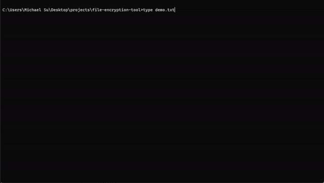

# file-encryption-tool



# file-encryption-tool

## Overview
This is a command-line tool for encrypting and decrypting files using AES-256 in CBC mode, with PBKDF2 for password-based key derivation. Includes HMAC for integrity and PKCS7 padding. Modular design with full unit tests achieving 100% coverage.

## Features
- Password-based encryption/decryption with AES-256.
- Integrity verification via HMAC to detect tampering.

## Requirements
- Python 3.13.6
- Dependencies (in `requirements.txt`):
  ```
  cryptography==43.0.3
  pytest==8.3.3
  coverage==7.6.1
  ```

## Setup
1. Clone the repository:
   ```
   git clone <repo-url>
   cd file_encryptor
   ```
2. Create and activate virtual environment:
   ```
   python -m venv venv
   venv\Scripts\activate
   ```
3. Install dependencies:
   ```
   pip install -r requirements.txt
   ```

## Usage
- Encrypt: `python main.py encrypt <input_file> <output_file> <password>`
- Decrypt: `python main.py decrypt <input_file> <output_file> <password>`

Example:
- Encrypt: `python main.py encrypt test.txt encrypted.enc mypassword`
- Decrypt: `python main.py decrypt encrypted.enc decrypted.txt mypassword`

## Testing
Run tests with 100% coverage:
```
coverage run --parallel-mode -m pytest tests/
coverage combine
coverage report -m
```

## License

MIT License. See [LICENSE](LICENSE) for details.
